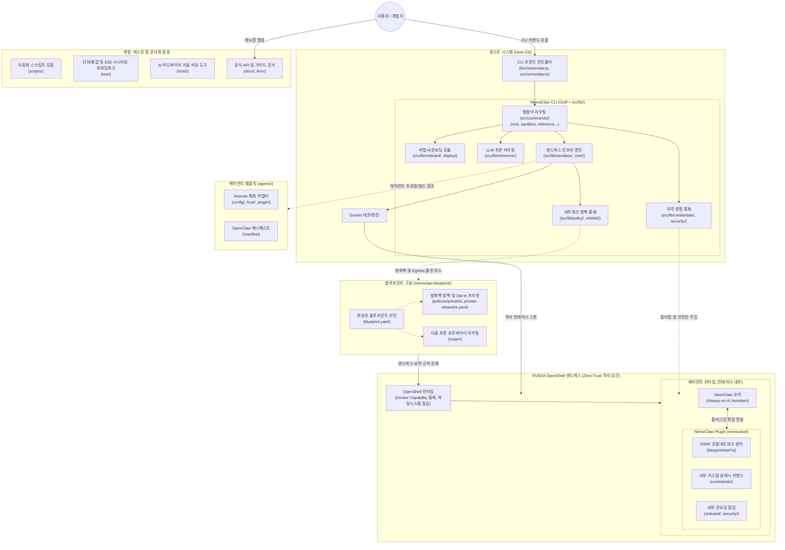

# NVIDIA NemoClaw 프로젝트 아키텍처 및 파일 구조

NemoClaw는 **NVIDIA OpenShell** 샌드박스 내부에서 **OpenClaw** 에이전트를 안전하게 실행하기 위한 오픈소스 레퍼런스 스택입니다. 시스템은 크게 호스트(Host) 영역과 샌드박스(Sandbox) 영역으로 분리되어 보안과 격리를 유지합니다.

## 1. 아키텍처 개요

### 시스템 아키텍처 다이어그램

### 핵심 아키텍처 컴포넌트

#### 1. NemoClaw CLI (`bin/`, `src/`)
* **역할**: 터미널 기반 CLI로, 에이전트 샌드박스의 구성(Onboarding), 관리, 그리고 추론 엔진 연결을 담당합니다.

#### 2. NVIDIA OpenShell & Blueprint (`nemoclaw-blueprint/`)
* **역할**: 에이전트가 실행되는 실제 환경을 외부로부터 격리하며 네트워크 정책, 모델 호환성 매니페스트 등을 정의합니다.

#### 3. NemoClaw Plugin (`nemoclaw/`)
* **역할**: 격리된 샌드박스 내부에서 OpenClaw 시스템에 동작하는 확장 플러그인입니다. SSRF 방어, 상태 스냅샷 저장 등을 담당합니다.

#### 4. 에이전트 템플릿 (`agents/`)
* **역할**: Hermes, OpenClaw 등의 특정 에이전트 모델 설정과 런타임을 구성합니다.

---

## 2. 보안 설계

### 🛡️ 시스템 보안 심층 방어 체계 (Defense-in-Depth)

NemoClaw는 인프라부터 코드 레벨까지 총 13가지의 다층적 보안 기능(Zero-Trust)을 제공합니다.

#### 1. 샌드박스 격리 및 컨테이너 하드닝
* **최소 권한 실행 (Non-root Execution)**: `run_as_user: sandbox`를 통해 에이전트의 관리자 권한을 박탈.
* **읽기 전용 파일 시스템 (Read-Only Rootfs)**: 샌드박스의 핵심 폴더(`/usr`, `/etc` 등)를 잠가 악성 바이너리 주입 차단.
* **Linux Capability 회수**: 시스템 시간 변경, 네트워크 조작 등 위험한 특권 40여 개를 압수.
* **시스템 콜 필터링 (Seccomp/Landlock)**: 해커가 커널 취약점을 공격하지 못하도록 위험한 시스템 호출 검열.

#### 2. 제로 트러스트 네트워크 (Network Egress Control)
* **기본 차단 원칙 (Default Deny)**: 명시적으로 허용되지 않은 모든 아웃바운드 인터넷 접속 차단.
* **바이너리 레벨 통제**: 도메인뿐만 아니라 "어떤 프로그램(예: openclaw)만 통신 가능한지" 지정하여 통제.
* **HTTP Method 차단**: 특정 엔드포인트로 데이터를 유출(POST)하지 못하도록 읽기(GET)만 허용.
* **Opt-in 프리셋**: Slack, Discord 등 서드파티 통신은 기본 차단되며, 사용자의 명시적 승인 시에만 활성화.

#### 3. 로컬 네트워크 보호 및 SSRF 방어
* **사설망 접속 차단**: 플러그인을 통한 `192.168.x.x`, `127.0.0.1` 등 내부 IP 스캔 및 공유기 공격 원천 차단.
* **DNS 핀닝 (DNS Pinning)**: 외부 도메인으로 위장한 내부망 우회 접속(DNS Rebinding) 꼼수 방어.

#### 4. 자격 증명 보호 및 감사 (Credential & Forensics)
* **출력 리댁션 (Stream Real-time Redaction)**: API 키가 화면 로그에 출력되기 0.001초 전에 `[REDACTED]`로 실시간 치환.
* **안전한 키 저장소**: 설정 파일(Plaintext) 대신 운영체제의 안전한 키체인에 저장 후 런타임 주입.
* **어펜드 온리 보안 감사 로그 (Audit Logging)**: 쉴드 조작 등 모든 보안 관련 이벤트를 지울 수 없는 형태로 기록(`shields-audit.jsonl`).

#### 5. 설정 불변성 및 시한폭탄 복구 (Shields & Timer)
* **쉴드 모드 (Shields Up - Immutable Config)**: 실행 중인 에이전트의 설정 폴더 소유권을 `root`로 뺏고, `chattr +i` 불변 비트를 걸어 해커의 프롬프트 조작 완전 차단.
* **보안 타이머 자동 복구**: 부득이하게 쉴드를 내렸을 때(Shields Down), 타이머가 만료되면 샌드박스를 원래의 안전한 상태로 자동 롤백.
* **내부 시크릿 스캐너**: 샌드박스 내부를 순찰하며 유출된 민감 정보가 방치되어 있는지 실시간 검사.

#### 6. 마이크로 방어 기술 (Edge-Case Defenses)
* **Dockerfile 인젝션 방어**: 사용자 입력값을 필터링하여 샌드박스 빌드 중 악성 명령어(`; rm -rf /`) 주입 방지.
* **경로 탐색 공격 차단 (Traversal Guard)**: 플러그인 로드나 파일 압축 해제 시 `../` 기호를 이용한 호스트 시스템 파일 탈취(Zip Slip) 완벽 차단.
* **Docker 소켓 하이재킹 방어**: 샌드박스 내부에서 호스트의 Docker 데몬에 몰래 바인딩하여 탈옥하는 시도 차단.
* **개발자 보안 규율 강제 (AppSec)**: 개발자가 소스 코드에서 환경 변수에 직접 접근(`process.env`)하지 못하도록 ESLint 룰로 원천 봉쇄.

---

## 3. 프로젝트 전체 파일 상세 구조

본 문서는 NemoClaw 프로젝트 내의 주요 디렉토리와 **개별 파일**의 역할을 상세히 설명합니다.

---

### 3.1. 루트 디렉토리 (Root Directory)
프로젝트 전반의 메타데이터, 설정 파일, 진입점 스크립트들입니다.

- `AGENTS.md`: AI 코딩 어시스턴트를 위한 프로젝트 아키텍처, 룰셋 및 디렉토리 구조 가이드.
- `CLAUDE.md`: Claude 에이전트용 설정 참조 파일 (`.claude/` 심링크 관련).
- `CODE_OF_CONDUCT.md`: 오픈소스 프로젝트 기여자와 사용자를 위한 행동 강령.
- `CONTRIBUTING.md`: PR 작성 요건 및 기여자 가이드라인.
- `Dockerfile`: NemoClaw 샌드박스의 메인 런타임 컨테이너 이미지 빌드 정의 파일.
- `Dockerfile.base`: 메인 컨테이너 빌드 전, 베이스 OS 및 필수 패키지 레이어 빌드 파일.
- `LICENSE`: 프로젝트의 오픈소스 라이선스(Apache 2.0).
- `Makefile`: 빌드(`make build`), 테스트(`make check`), 문서 생성(`make docs`) 등을 자동화하는 Make 스크립트.
- `PROJECT_STRUCTURE.md`: 현재 열람 중인 프로젝트 전체 구조 문서.
- `README.md`: 프로젝트 개요, 설치 방법 및 시작 가이드를 담은 메인 소개 문서.
- `SECURITY.md`: 보안 취약점 보고 절차 및 보안 관련 정책 가이드.
- `biome.json`: Biome 린터 및 포매터 설정.
- `commitlint.config.js`: 커밋 메시지 규칙(Conventional Commits) 검증 설정 파일.
- `install.sh`: NemoClaw CLI 및 환경을 설치하는 셸 스크립트.
- `jsconfig.json`: CommonJS 코드에 대한 VS Code의 JS 언어 지원 및 타입 힌트 설정.
- `package-lock.json`: 루트 프로젝트의 NPM 패키지 의존성 트리를 잠금(고정)하는 파일.
- `package.json`: 루트 프로젝트의 메타데이터, NPM 스크립트, 주요 라이브러리 의존성 정의.
- `pyproject.toml`: Python 환경 구성 및 의존성 관리 도구 설정.
- `spark-install.md`: Spark 연동 관련 임시 설치 메모.
- `tsconfig.cli.json`: CLI 소스 코드를 TypeScript에서 JavaScript로 컴파일하기 위한 옵션.
- `tsconfig.src.json`: 루트 소스 코드 전반의 TypeScript 컴파일러 설정 파일.
- `uninstall.sh`: NemoClaw 환경 및 CLI 제거 셸 스크립트.
- `uv.lock`: Python 패키지 매니저 `uv`가 사용하는 의존성 잠금 파일.
- `vitest.config.ts`: Vitest 통합/E2E 테스트 프레임워크 설정 파일.

**개발 도구 설정 파일 (Dotfiles):**
- `.coderabbit.yaml`: CodeRabbit AI 코드 리뷰 설정.
- `.dockerignore`: Docker 빌드 제외 패턴.
- `.editorconfig`: 에디터 통일 설정 (인코딩, 들여쓰기 등).
- `.gitattributes`: Git 속성 설정.
- `.gitmodules`: Git 서브모듈 정의.
- `.gitleaksignore`: Gitleaks 오탐(false positive) 무시 목록.
- `.markdownlint-cli2.yaml`: Markdown 린트 설정.
- `.pre-commit-config.yaml`: Pre-commit 훅 설정.
- `.prettierignore`: Prettier 포매터 무시 파일 목록.
- `.shellcheckrc`: ShellCheck 린터 설정.

---

### 3.2. `.github/` & `ci/` (GitHub CI/CD & Templates)
- `.github/ISSUE_TEMPLATE/*` (`bug_report.yml` 등): 이슈 생성 시 사용자에게 보여지는 템플릿들.
- `ci/coverage-threshold-cli.json`, `coverage-threshold-plugin.json`: CI 파이프라인에서 체크하는 코드 커버리지(테스트 범위) 하한선.
- `ci/env-var-doc-allowlist.json`: 문서화가 허용된 환경 변수 목록.
- `ci/platform-matrix.json`: 테스트가 실행될 지원 플랫폼 매트릭스(OS 등).
- `ci/source-shape-test-budget.json`: 소스 셰이프 기반 테스트 버짓 관리 설정.

---

### 3.3. `agents/` (에이전트 특화 설정)
OpenClaw 및 특수 에이전트(Hermes 등)에 대한 빌드 및 설정 파일.
- `agents/hermes/config/`: Hermes 전용 환경 설정 및 파싱 관리 구조체들.
- `agents/hermes/host/`: Hermes 에이전트를 호스트 시스템과 연동하는 어댑터 로직.
- `agents/hermes/plugin/`: Hermes에 주입되는 플러그인 패키지.
- `agents/hermes/generate-config.ts`: Hermes 설정 생성 빌드 타임 진입점.
- `agents/hermes/manifest.yaml`: Hermes 에이전트 매니페스트 정의.
- `agents/hermes/policy-additions.yaml`, `policy-permissive.yaml`: Hermes 전용 네트워크 정책 추가/완화 설정.
- `agents/hermes/start.sh`: Hermes 에이전트 시작 스크립트.
- `agents/hermes/Dockerfile`, `Dockerfile.base`: Hermes 전용 컨테이너 이미지 빌드 파일.
- `agents/openclaw/manifest.yaml`: OpenClaw 에이전트 매니페스트 정의.
- `agents/openclaw/policy-permissive.yaml`: OpenClaw 완화 정책 설정.

---

### 3.4. `bin/` (CLI Entry Points)
CommonJS로 작성되어 CLI의 안정적 시작을 보장하는 어댑터들입니다.
- `bin/nemoclaw.js`: 터미널에서 `nemoclaw` 명령어를 입력할 때 호출되는 실제 실행 파일.
- `bin/nemohermes.js`: Hermes 에이전트 환경에 특화된 호환성 CLI 래퍼.
- `bin/lib/`: 기타 런처 및 유틸리티(사용 고지 등)가 위치하는 폴더.

---

### 3.5. `docs/` & `fern/` (사용자 공식 문서)
Fern MDX 기반의 문서 프레임워크를 사용합니다.
- `docs/index.mdx`: 사용자 가이드 메인 홈페이지 (MDX 기반).
- `docs/index.yml`: 문서 네비게이션 및 인덱스 구조 정의.
- `docs/CONTRIBUTING.md`: 공식 문서 기여자 가이드라인.
- `docs/.docs-skip`: 문서 생성 스킵 설정.
- `docs/_components/`, `docs/_ext/`, `docs/_templates/`: Fern 확장 컴포넌트, 확장 모듈, 템플릿.
- `docs/about/`, `docs/get-started/`, `docs/deployment/`: 프로젝트 소개, 시작 가이드, 배포 가이드.
- `docs/inference/`, `docs/network-policy/`, `docs/security/`: 추론 설정, 네트워크 정책, 보안 가이드.
- `docs/manage-sandboxes/`, `docs/monitoring/`: 샌드박스 관리 및 모니터링 가이드.
- `docs/reference/`, `docs/resources/`: CLI 레퍼런스 및 기타 리소스.
- `fern/fern.config.json`: Fern 프로젝트 설정.
- `fern/docs.yml`: Fern 문서 사이트 구조 및 네비게이션 설정.
- `fern/main.css`: 문서 사이트 스타일링.
- `fern/assets/`, `fern/components/`: 문서에서 쓰이는 이미지 자산 및 공통 재사용 컴포넌트들.

---

### 3.6. `nemoclaw-blueprint/` (블루프린트 구성)
샌드박스 정책(네트워크, 런타임)을 YAML 형태로 구성합니다.
- `nemoclaw-blueprint/blueprint.yaml`: 샌드박스의 최상위 권한 및 연결 블루프린트, 프로바이더 프로필 정의.
- `nemoclaw-blueprint/private-networks.yaml`: 내부 통신용 네트워크 허용 범위 정의.
- `nemoclaw-blueprint/tsconfig.json`: 블루프린트 내부 스크립트용 TS 설정.
- `nemoclaw-blueprint/model-specific-setup/`: 에이전트 모델별 구체적인 실행 셋업 모듈들 (`hermes/`, `openclaw/`, `schema.json`, `README.md`).
- `nemoclaw-blueprint/openclaw-plugins/kimi-inference-compat/`: OpenClaw 모델의 Kimi 인퍼런스 연동 호환성을 보정하는 래퍼.
- `nemoclaw-blueprint/policies/openclaw-sandbox.yaml`: 기본 보안 정책 (Default Deny).
- `nemoclaw-blueprint/policies/openclaw-sandbox-permissive.yaml`: 개발/테스트용 완화 정책.
- `nemoclaw-blueprint/policies/tiers.yaml`: 보안 정책 티어(단계별 엄격도) 정의.
- `nemoclaw-blueprint/policies/presets/`: 디스코드, 슬랙, 깃허브, WeChat, Brave 등 사용자가 명시적으로 활성화할 수 있는(Opt-in) 외부 통신 정책 파일들 (20개 프리셋).
- `nemoclaw-blueprint/provider-profiles/`: 추론 프로바이더별 추가 프로필 설정 (`brave.yaml`).
- `nemoclaw-blueprint/router/pool-config.yaml`: 다중 LLM 공급자 간의 라우팅 풀 설정.
- `nemoclaw-blueprint/scripts/`: 샌드박스 런타임 보안 가드 스크립트 8개 (`sandbox-safety-net.js`, `seccomp-guard.js`, `ciao-network-guard.js`, `http-proxy-fix.js`, `nemotron-inference-fix.js`, `slack-channel-guard.js`, `telegram-diagnostics.js`, `wechat-diagnostics.js`).

---

### 3.7. `nemoclaw/` (OpenClaw 플러그인)
OpenClaw 샌드박스 내부에서 기생하며 구동되는 확장 플러그인입니다.
- `nemoclaw/package.json`, `package-lock.json`, `tsconfig.json`: 플러그인 전용 NPM 및 TS 빌드 설정.
- `nemoclaw/openclaw.plugin.json`: 플러그인 매니페스트.
- `nemoclaw/vitest.config.ts`: 플러그인 단위 테스트용 Vitest 설정.
- `nemoclaw/src/blueprint/`: SSRF 쉴드 등 내부 보안 통제.
- `nemoclaw/src/commands/`: 에이전트 내부 TUI 환경 등에서 쓰이는 슬래시 명령어들.
- `nemoclaw/src/lib/`: 프로세스 환경 변수 제어 등 플러그인 공통 유틸리티.
- `nemoclaw/src/onboard/`, `security/`: 샌드박스 내부 초기화 및 시크릿 토큰 스캐닝을 막기 위한 보안 도구.

---

### 3.8. `schemas/` (검증용 스키마)
- `schemas/blueprint.schema.json`: `blueprint.yaml` 형식이 올바른지 검증.
- `schemas/onboard-config.schema.json`: 온보딩 설정값 규격 검사.
- `schemas/openclaw-plugin.schema.json`: 플러그인 매니페스트 파일 검증.
- `schemas/policy-preset.schema.json`: 정책 프리셋 파일 검증.
- `schemas/router-pool-config.schema.json`: 라우터 풀 설정 검증.
- `schemas/sandbox-policy.schema.json`: 샌드박스 기본 방화벽 정책 검증.

---

### 3.9. `scripts/` (자동화 스크립트)
설치, 빌드 검증, 문서 변환, 릴리스 등을 자동화하는 46개의 스크립트와 3개의 하위 디렉토리로 구성됩니다.
- `scripts/install.sh`, `scripts/install-openshell.sh`: 설치 자동화 및 OS 패키지 구성 도구.
- `scripts/backup-workspace.sh`: 워크스페이스 백업 도구.
- `scripts/benchmark-sandbox-image-build.js`: 샌드박스 빌드 시간 및 성능 측정.
- `scripts/generate-openclaw-config.py`, `scripts/docs-to-skills.py`: 런타임 설정 생성 및 마크다운 문서 -> AI 스킬 변환 스크립트.
- `scripts/bump-version.ts`: 릴리스 시 모든 버전 문자열을 일괄 범프하는 스크립트.
- `scripts/nemoclaw-start.sh`: 샌드박스 시작 프로세스를 담당하는 대형 스크립트.
- `scripts/bootstrap-windows.ps1`: Windows 환경 부트스트랩 PowerShell 스크립트.
- `scripts/convert-docs-to-fern.mjs`, `scripts/watch-fern-preview.mjs`: Fern 문서 변환 및 프리뷰 도구.
- `scripts/export-catalog-skills.py`: 스킬 카탈로그 내보내기.
- `scripts/seed-wechat-accounts.py`: WeChat 계정 시딩.
- `scripts/patch-openclaw-chat-send.js`, `scripts/patch-openclaw-tool-catalog.js`: OpenClaw 런타임 패치 스크립트.
- `scripts/find-source-shape-tests.ts`, `scripts/type-safety-hotspots.ts`: 코드 품질 분석 도구.
- `scripts/walkthrough.sh`: 튜토리얼 진행용 헬퍼 스크립트.
- 기타 `check-*.ts`, `test-*.sh`, `setup-*.sh` 등: CI에서 빌드 검증 및 테스트 보조를 위해 활용되는 스크립트.

---

### 3.10. `src/` (코어 CLI 백엔드 스택)
NemoClaw CLI의 실제 동작 코드가 기능별로 분리되어 있습니다.

#### `src/nemoclaw.ts`
* 얇은 호환성 프론트 컨트롤러(Front Controller). 과거의 모놀리식 구조에서 탈피하여, `public-dispatch.ts`로 실행을 즉시 위임합니다.

#### `src/commands/` (CLI 서브 커맨드 정의)
서브 디렉토리 및 루트 레벨 커맨드 파일로 구성됩니다.
* `src/commands/root/`: 최상위 전역 명령어 모음.
* `src/commands/sandbox/`: `start`, `stop`, `rebuild` 등 샌드박스 자체 생애주기를 관리하는 명령어.
* `src/commands/credentials/`: API Key, 토큰 등 자격증명의 갱신 및 해지 명령어.
* `src/commands/inference/`: LLM 공급자(Provider) 환경 설정 및 라우팅 제어.
* `src/commands/tunnel/`: 로컬 포트포워딩, 터널링 제어.
* `src/commands/internal/`: 일반 사용자에게 보이지 않는 디버깅용 백그라운드 명령어들.
* 루트 레벨 커맨드 파일들: `deploy.ts`, `start.ts`, `stop.ts`, `status.ts`, `list.ts`, `onboard.ts`, `setup.ts`, `setup-spark.ts`, `debug.ts`, `gc.ts`, `credentials.ts`, `backup-all.ts`, `update.ts`, `upgrade-sandboxes.ts`, `uninstall.ts`, `resources.ts` 등 22개의 독립 커맨드.

#### `src/lib/` (비즈니스 핵심 로직 폴더)
* `src/lib/actions/`, `adapters/`, `cli/`: Oclif 명령어 실행 이후 동작하는 외부 통신 어댑터 및 CLI 유틸리티.
* `src/lib/agent/`, `core/`, `domain/`, `state/`: 에이전트 구조체, 샌드박스 런타임 상태 등의 도메인 모델 관리.
* `src/lib/credentials/`, `security/`, `shields/`, `policy/`: 로컬 키체인 저장소 연동, 시크릿 정보 마스킹 쉴드, 접근 통제 정책 파일 파싱 모듈.
* `src/lib/dashboard/`, `diagnostics/`: 상태 점검 모니터링 데몬 접속 및 트러블슈팅 로직.
* `src/lib/deploy/`, `onboard/`, `inventory/`: 대화형 마법사(Wizard) 초기 구축 및 로컬 레지스트리 기록.
* `src/lib/inference/`: Ollama, vLLM, NVIDIA NIM 등 추론 서버의 프로브(Probe) 체크와 설정 관리기능.
* `src/lib/sandbox/`: Docker API 소켓 통신을 기반으로 컨테이너를 직접 구동하고 생애 주기를 전담 관리하는 핵심 인프라 엔진.
* `src/lib/tunnel/`: 네트워크 포트 터널링과 SSH 등 연결 관리 유틸리티.
* `src/lib/messaging/`: 메시징 채널(Telegram, Discord, Slack, WeChat 등) 연동 설정 및 충돌 감지.
* `src/lib/gateway-runtime-action.ts`, `gateway-token-command.ts`: 추론 게이트웨이 런타임 및 토큰 관리.
* `src/lib/hermes-provider-auth.ts`, `hermes-tool-gateway-broker.ts`: Hermes 에이전트 전용 인증 및 도구 게이트웨이 브로커.
* `src/lib/share-command.ts`: 샌드박스 공유 기능.
* `src/lib/trace.ts`: 런타임 트레이싱 및 디버그 로그 수집.
* `src/lib/oauth-device-code.ts`: OAuth 디바이스 코드 플로우 인증.
* `src/lib/skill-install.ts`: 에이전트 스킬 설치 기능.
* `src/lib/sandbox-base-image.ts`, `cluster-image-patch.ts`: 샌드박스 베이스 이미지 및 클러스터 이미지 패치 관리.
* `src/lib/verify-deployment.ts`: 배포 검증 로직.

#### `src/ext/` (외부 연동 모듈)
* `src/ext/wechat/`: 위챗(WeChat) 등의 기타 외부 채널 통신을 위한 로직 모음.

---

### 3.11. `test/` (통합 & E2E 테스트)
단위 테스트는 각 모듈 근처에 `.test.ts` 확장자로 존재하나 통합/E2E 테스트는 이곳에서 집중 관리합니다.
- `test/cli.test.ts` 등 `src/` 의 기능별 유닛 및 통합 테스트 스크립트.
- `test/e2e/e2e-test.sh`, `e2e-non-root-smoke.sh` 등: 실제 운영체제 레벨에서 동작을 모의하는 셸 스크립트.
- `test/e2e/nemoclaw_scenarios/`, `onboarding_assertions/`, `validation_suites/`: 온보딩부터 특정 유스케이스까지의 포괄적인 시스템 자동화 검증 시나리오 프레임워크 모음.
- `test/helpers/`: 목업 생성 및 타임아웃 헬퍼 유틸리티.

---

### 3.12. `tools/` (개발 보조 및 리뷰 자동화 툴)
- `tools/advisors/`: 코드 작성 가이드를 보조하는 어드바이저 스크립트들.
- `tools/e2e-advisor/`: 복잡한 E2E 테스트 실행 로그를 파싱하고 분석해주는 도구.
- `tools/e2e-scenarios/`: E2E 테스트 시나리오 워크플로우 정의 (`workflow-boundary.mts`).
- `tools/pr-review-advisor/`: 깃허브 Pull Request를 읽어 자동으로 코드 리뷰 코멘트를 달아주는 AI 어시스턴트 유틸리티.

---

## 4. 코드 분석 추천 가이드

### 🚀 어디서부터 읽어야 할까?

NemoClaw처럼 CLI 도구, 컨테이너 샌드박스, 플러그인이 결합된 복잡한 아키텍처를 분석할 때는 실제 실행 흐름(Execution Flow)을 따라가며 읽는 것을 강력히 추천합니다.

#### 1. 진입점과 명령어 라우팅 (CLI Entry) - 추천 시작점 ⭐️
사용자가 `nemoclaw` 명령어를 쳤을 때 가장 먼저 파싱되는 경로입니다.
* `bin/nemoclaw.js`: Node.js 환경의 런처 스크립트.
* `src/nemoclaw.ts`: CLI 진입점 (프론트 컨트롤러).
* `src/commands/`: `oclif` 프레임워크 기반으로 분류된 서브 커맨드들이 위치합니다. 사용하려는 명령어 기능의 폴더부터 분석하세요.

#### 2. 초기 설정 및 온보딩 (Onboarding & Config)
사용자가 샌드박스를 구축하고, 외부 API 통신을 설정하는 과정입니다.
* `src/lib/onboard/`: 대화형 마법사 UI 구현 및 인퍼런스 상태 점검.
* `src/lib/credentials/`: API 키를 시스템의 키체인에 안전하게 저장하고 로드.

#### 3. 샌드박스 인프라 엔진 (Sandbox & Docker)
샌드박스가 어떻게 격리 구성되고, 컨테이너로 스폰(Spawn)되는지 확인합니다.
* `src/lib/sandbox/`: Docker 데몬과 통신하고 컨테이너의 생애 주기를 전적으로 관장하는 엔진.

#### 4. 네트워크와 보안 통제 (Policies & Blueprint)
에이전트가 허용된 범위를 벗어나지 못하게 하는 보안 정책의 핵심부입니다.
* `nemoclaw-blueprint/blueprint.yaml`: 샌드박스의 기반 이미지 해시 및 프로바이더의 선언적 명세.
* `src/lib/policy/`: Blueprint 파일들을 로드하고 실제로 방화벽/접근제어 룰셋으로 변환하여 강제하는 로직.

#### 5. 샌드박스 내부 플러그인 (Inside the Sandbox)
호스트 영역이 아닌 컨테이너 내부(OpenClaw)에서 기생하며 동작하는 확장 코드입니다.
* `nemoclaw/src/`: 에이전트 전용 슬래시 커맨드, SSRF 통제 쉴드 등의 런타임 구현부.
