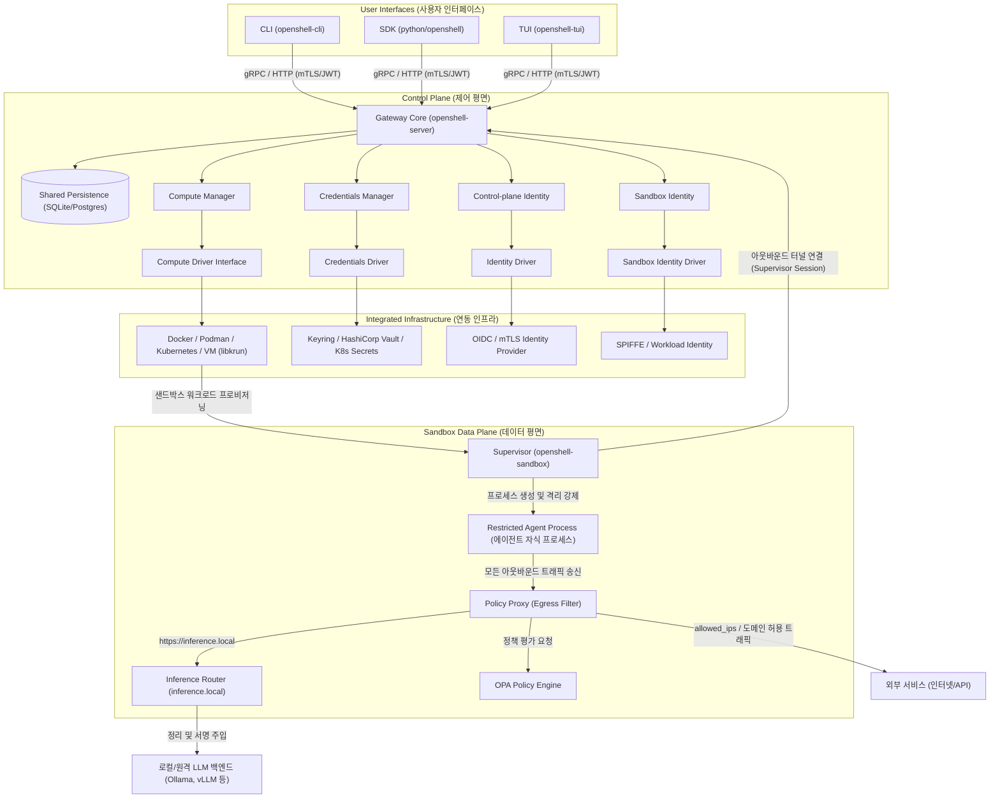

# OpenShell 상세 아키텍처 및 디렉토리 구조 분석 보고서

이 문서는 OpenShell 프로젝트의 전체 시스템 아키텍처와 디렉토리 구조, 그리고 개별 폴더 및 파일의 역할을 매우 상세하게 정리한 문서입니다.

---

## 1. OpenShell 전체 아키텍처 개요

OpenShell은 자율 주행 AI 에이전트(Autonomous AI Agents)를 명확한 보안 정책(Policy), 자격 증명(Credential), 신원(Identity) 및 네트워크 경계 내에서 안전하게 실행하기 위한 샌드박스 플랫폼입니다. 

전체 아키텍처는 크게 세 가지 핵심 컴포넌트로 나뉩니다:
1. **User Interfaces (CLI, SDK, TUI)**: 사용자가 플랫폼을 조작하고 상태를 확인하기 위한 인터페이스.
2. **Gateway (Control Plane)**: API 서빙, 상태 유지(Persistence), 정책 관리 및 배포, 자격 증명 관리 및 전달, 컴퓨트 드라이버 조정 등을 담당하는 중앙 인증 제어 평면.
3. **Supervisor & Sandbox (Data Plane)**: 각 에이전트 샌드박스 내부에서 실행되는 격리 관리 백시(Daemon). 에이전트를 비특권 자식 프로세스로 실행하고 Landlock, Seccomp, Egress Proxy, Inference Router를 통해 보안 및 네트워크 정책을 현장(Local)에서 강제합니다.

### 1.1 High-Level 시스템 구성도



---

### 1.2 아웃바운드 연결 세션 및 릴레이 메커니즘 (Supervisor Relay)

OpenShell은 샌드박스의 인바운드 포트를 노출하지 않는 **아웃바운드 개시형 터널 구조**를 가집니다. 샌드박스 내부의 Supervisor가 Gateway로 `ConnectSupervisor` 스트림을 먼저 개시한 뒤 대기하며, 사용자가 에이전트에 SSH 접속이나 명령 실행, 파일 동기화를 원할 때 이 터널을 통해 멀티플렉싱된 바이트 릴레이를 연결합니다.

```mermaid
sequenceDiagram
    participant CLI as CLI / TUI / Client
    participant GW as Gateway (Control Plane)
    participant SUP as Sandbox Supervisor (Inside Sandbox)
    participant Target as Target Socket (SSH / Service)

    Note over SUP,GW: 샌드박스 기동 시 터널 개시
    SUP->>GW: ConnectSupervisor stream (mTLS 인증)
    
    Note over CLI,GW: 사용자가 명령 실행/SSH 연결 요청
    CLI->>GW: ForwardTcp / Exec / File Sync Request
    GW->>SUP: RelayOpen(channel, target) (기존 터널을 통해 전달)
    
    SUP->>Target: 내부 SSH 소켓 또는 루프백 서비스 포트와 Dial
    SUP->>GW: RelayStream(channel) 응답 및 연결 완료
    
    rect rgb(20, 20, 40)
        Note over CLI,Target: 데이터 스트림 릴레이 중계 (양방향)
        CLI->>GW: Client Payload
        GW->>SUP: Relay Payload
        SUP->>Target: Target Payload
        Target-->>SUP: Response Payload
        SUP-->>GW: Relay Response
        GW-->>CLI: Client Response
    end
```



---

## 2. 프로젝트 디렉토리 구조 및 역할 상세

OpenShell 프로젝트는 Rust 작업 공간(Cargo Workspace)과 Python 작업 공간(uv/poetry)이 결합된 Monorepo 구조로 설계되어 있습니다.

```
OpenShell / (Root)
├── .agents/                    # 에이전트 인프라 및 자동화 워크플로우 정의
│   ├── agents/                 # 서브 에이전트 페르소나 설정
│   └── skills/                 # 에이전트 실행 자동화 스킬 (build, triage 등)
├── .cargo/                     # Rust 카고 빌드 설정
├── .claude/                    # Claude Code 에이전트 메모리, 에이전트, 스킬 심볼릭 링크
├── .github/                    # GitHub Actions CI/CD 워크플로우
├── .opencode/                  # OpenCode 에이전트 설정
├── architecture/               # 설계/아키텍처 문서 저장소
├── crates/                     # Core Rust 크레이트 모음 (플랫폼 엔진)
├── deploy/                     # 배포 관련 설정 (Docker, Helm, Kube, Man, RPM/Deb, Snap)
├── docs/                       # MDX 기반의 사용자 문서 사이트 원본
├── e2e/                        # End-to-End 통합 테스트 스위트
├── examples/                   # 개발자용 레퍼런스 구현 및 정책 가이드
├── fern/                       # Fern 문서 생성기 설정 및 테마 자산
├── proto/                      # gRPC 통신을 위한 Protocol Buffers 인터페이스 정의
├── providers/                  # Provider YAML 정의 파일 (claude-code, github, nvidia 등)
├── python/                     # Python SDK 및 바인딩 (openshell 패키지)
├── rfc/                        # 디자인 제안서 (Requests for Comments)
├── scripts/                    # 유틸리티 및 헬퍼 스크립트
├── tasks/                      # 빌드/배포 자동화 태스크 스크립트
└── 루트 파일들                  # AGENTS.md, Cargo.toml, pyproject.toml, mise.toml 등
```

### 2.1 루트 디렉토리 주요 파일

#### 문서 및 가이드
*   [AGENTS.md](file:///home/gildellmint/Workspace/AGENTS/security/OpenShell/AGENTS.md): AI 코딩 에이전트가 이 프로젝트에서 작업할 때 준수해야 할 개발 지침, 커밋 컨벤션, 브랜치 전략, 보안 규칙을 정의한 최우선 지침서.
*   [CLAUDE.md](file:///home/gildellmint/Workspace/AGENTS/security/OpenShell/CLAUDE.md): Claude Code 에이전트용 설정 (AGENTS.md로 리다이렉트).
*   [CI.md](file:///home/gildellmint/Workspace/AGENTS/security/OpenShell/CI.md): CI 파이프라인 구조와 테스트 실행 방법, 라벨 정책을 서술한 문서.
*   [CONTRIBUTING.md](file:///home/gildellmint/Workspace/AGENTS/security/OpenShell/CONTRIBUTING.md): 프로젝트 빌드 방식, 구조 설명, 에이전트 스킬 목록을 포함한 기여자용 종합 안내서.
*   [README.md](file:///home/gildellmint/Workspace/AGENTS/security/OpenShell/README.md): 프로젝트의 기본 목적, 특징 및 로컬 샌드박스 시작 방법을 안내하는 메인 리드미.
*   [SECURITY.md](file:///home/gildellmint/Workspace/AGENTS/security/OpenShell/SECURITY.md): 보안 취약점 보고 프로세스 및 보안 대응 지침서.
*   [STYLEGUIDE.md](file:///home/gildellmint/Workspace/AGENTS/security/OpenShell/STYLEGUIDE.md): 코드 품질, 주석 규칙, 테스트 코드 구현 가이드라인.
*   [TESTING.md](file:///home/gildellmint/Workspace/AGENTS/security/OpenShell/TESTING.md): 단위 테스트 및 통합 테스트 작성 가이드.
*   [DCO](file:///home/gildellmint/Workspace/AGENTS/security/OpenShell/DCO): Developer Certificate of Origin.
*   [LICENSE](file:///home/gildellmint/Workspace/AGENTS/security/OpenShell/LICENSE): Apache-2.0 라이선스 원문.
*   [THIRD-PARTY-NOTICES](file:///home/gildellmint/Workspace/AGENTS/security/OpenShell/THIRD-PARTY-NOTICES): 서드파티 의존성 라이선스 공지.

#### 빌드 및 패키징 설정
*   [Cargo.toml](file:///home/gildellmint/Workspace/AGENTS/security/OpenShell/Cargo.toml): Rust 작업 공간(Workspace) 전체의 멤버와 공통 의존성(Dependencies) 및 린트(Lints) 설정을 총괄하는 설정 파일.
*   [Cargo.lock](file:///home/gildellmint/Workspace/AGENTS/security/OpenShell/Cargo.lock): Rust 의존성의 빌드 버전을 고정하는 락 파일.
*   [rust-toolchain.toml](file:///home/gildellmint/Workspace/AGENTS/security/OpenShell/rust-toolchain.toml): Rust 툴체인 버전(에디션, 채널) 고정 설정.
*   [pyproject.toml](file:///home/gildellmint/Workspace/AGENTS/security/OpenShell/pyproject.toml): Python 패키징 도구 `uv` 기반의 파이썬 의존성 및 툴 설정 파일.
*   [uv.lock](file:///home/gildellmint/Workspace/AGENTS/security/OpenShell/uv.lock): 파이썬 패키지 버전을 잠그는 락 파일.
*   [.python-version](file:///home/gildellmint/Workspace/AGENTS/security/OpenShell/.python-version): 프로젝트에서 사용하는 Python 버전 고정.
*   [mise.toml](file:///home/gildellmint/Workspace/AGENTS/security/OpenShell/mise.toml): 다목적 개발 도구 버저닝 및 태스크 실행기(mise) 설정 파일 (기존의 Makefile 대용).
*   [mise.lock](file:///home/gildellmint/Workspace/AGENTS/security/OpenShell/mise.lock): mise 도구 버전 락파일.
*   [about.toml](file:///home/gildellmint/Workspace/AGENTS/security/OpenShell/about.toml): `cargo-about` 라이선스 수집 설정.
*   [openshell.spec](file:///home/gildellmint/Workspace/AGENTS/security/OpenShell/openshell.spec): RPM 패키지 빌드 spec 파일.
*   [snapcraft.yaml](file:///home/gildellmint/Workspace/AGENTS/security/OpenShell/snapcraft.yaml): Snap 패키지 빌드 설정.
*   [.packit.yaml](file:///home/gildellmint/Workspace/AGENTS/security/OpenShell/.packit.yaml): Packit CI/CD 통합 설정.

#### 유틸리티 및 기타
*   [install.sh](file:///home/gildellmint/Workspace/AGENTS/security/OpenShell/install.sh): OpenShell 플랫폼을 간단히 배포하기 위한 자동 설치 셸 스크립트.
*   [.env.example](file:///home/gildellmint/Workspace/AGENTS/security/OpenShell/.env.example): 환경 변수 예시 파일.
*   [.markdownlint-cli2.jsonc](file:///home/gildellmint/Workspace/AGENTS/security/OpenShell/.markdownlint-cli2.jsonc): Markdown 린트 규칙 설정.

---

### 2.2 crates/ 폴더 내 세부 크레이트 역할

OpenShell의 모든 핵심 로직은 `crates/` 폴더 내의 각 크레이트로 모듈화되어 있습니다.

| 크레이트 이름 | 주 목적 및 핵심 역할 | 주요 소스 파일 예시 및 설명 |
| :--- | :--- | :--- |
| [openshell-server](file:///home/gildellmint/Workspace/AGENTS/security/OpenShell/crates/openshell-server) | **제어 평면 (Control Plane)** Gateway 데몬.<br>인증, Persistence(DB), 정책 배포, API 라우팅, Supervisor 세션 중계 처리. | `src/main.rs`: 게이트웨이 데몬 엔트리포인트.<br>`src/persistence/`: SQLite/Postgres CAS(Compare-And-Swap) 영속성 계층.<br>`src/supervisor_session.rs`: 아웃바운드로 붙은 샌드박스와의 실시간 제어 커넥션 관리.<br>`src/multiplex.rs`: HTTP/gRPC 스트림 멀티플렉서.<br>`src/provider_refresh.rs`: 클라우드 자격 증명 주기적 갱신. |
| [openshell-sandbox](file:///home/gildellmint/Workspace/AGENTS/security/OpenShell/crates/openshell-sandbox) | **데이터 평면 (Data Plane)** 샌드박스 내부 Supervisor 데몬.<br>컨테이너 또는 VM 내부에서 실행되며 커널 격리, 보안 정책 적용, 릴레이 프록시 구동. | `src/main.rs`: 샌드박스 데몬 실행부.<br>`src/process.rs`: Landlock/비특권 유저 전환을 통한 자식 에이전트 격리 실행.<br>`src/proxy.rs`: L4/L7 에그레스 가로채기 프록시 터미네이터.<br>`src/opa.rs`: Open Policy Agent Rego 및 OPA 로컬 검증 실행 엔진.<br>`src/ssh.rs`: 에이전트 접속용 내장 SSH 서버.<br>`src/bypass_monitor.rs`: 프록시 우회 공격 시도 탐지. |
| [openshell-cli](file:///home/gildellmint/Workspace/AGENTS/security/OpenShell/crates/openshell-cli) | **사용자 인터페이스 (CLI)** 바이너리.<br>로컬 개발 환경용 또는 리모트 게이트웨이 제어용 CLI 도구. | `src/main.rs`: CLI 명령어 파싱 및 실행.<br>`src/run.rs`: 샌드박스를 직접 정의하고 띄우기 위한 로컬 런타임 제어 로직.<br>`src/ssh.rs`: 샌드박스로의 SSH 프록시 터널링 클라이언트.<br>`src/auth.rs` / `src/oidc_auth.rs`: 사용자 인증 및 로그인 흐름 제어. |
| [openshell-policy](file:///home/gildellmint/Workspace/AGENTS/security/OpenShell/crates/openshell-policy) | **정책 관리 라이브러리**.<br>보안 규칙(YAML 파일 등)을 구조화하고, 병합(Merge) 및 작성(Composition) 지원. | `src/lib.rs`: 정책 스키마 파싱 및 유효성 체크.<br>`src/merge.rs`: 상위 전역 정책과 샌드박스 고유 정책 간 정밀 병합 알고리즘. |
| [openshell-router](file:///home/gildellmint/Workspace/AGENTS/security/OpenShell/crates/openshell-router) | **추론 라우터 (Inference Router)**.<br>에이전트가 호출하는 `inference.local` 도메인의 AI 추론 요청을 로컬/원격 LLM 공급자 서버로 재라우팅. | `src/backend.rs`: Ollama, vLLM, sglang, TRT-LLM, OpenCode, OpenAI, Anthropic 등 백엔드 어댑터.<br>`src/config.rs`: 라우팅 규칙 및 API 토큰 은닉 관리. |
| [openshell-prover](file:///home/gildellmint/Workspace/AGENTS/security/OpenShell/crates/openshell-prover) | **정책 정적 분석기 (Static Analyzer)**.<br>Z3 SMT Solver를 활용하여 보안 정책 설정 및 크레덴셜 접근 규칙에 취약점이 없는지 수학적으로 증명 및 검증. | `src/lib.rs`: 분석 진입점.<br>`src/policy.rs` & `src/credentials.rs`: 정책과 크레덴셜 관계식 수학적 정형 모델링.<br>`src/report.rs`: 분석 발견 사항 리포팅. |
| [openshell-core](file:///home/gildellmint/Workspace/AGENTS/security/OpenShell/crates/openshell-core) | **공통 모듈**.<br>설정 스키마, 에러 처리, 네트워크/IP 유틸리티, 진행도 및 상태 보고 메타데이터 정의. | `src/config.rs`: 공유 설정 스키마 정의.<br>`src/net.rs`: SSRF 방지를 위한 사설/공용 IP 범위 검사기.<br>`src/forward.rs`: 바이트 중계 릴레이 포워딩 기본 로직. |
| [openshell-ocsf](file:///home/gildellmint/Workspace/AGENTS/security/OpenShell/crates/openshell-ocsf) | **OCSF 규격 구조화 로그 모듈**.<br>보안 규격 OCSF(v1.7.0)에 따르는 실시간 보안 감사 이벤트 로깅. | `src/builders/`: `NetworkActivity`, `ProcessActivity`, `SshActivity`, `DetectionFinding` 이벤트 빌더.<br>`src/tracing_layers/`: 구조화 로깅 어펜더 및 JSONL 포맷터. |
| [openshell-providers](file:///home/gildellmint/Workspace/AGENTS/security/OpenShell/crates/openshell-providers) | **자격 증명 연동 모듈 (Credentials Provider)**.<br>OpenAI, Claude, Copilot, GitHub, GitLab, NVIDIA API 키 등 연동 프로필 정의. | `src/profiles.rs`: 자격증명 프로필 및 설정 관리.<br>`src/providers/`: 개별 공급자별 API 핸들러 및 새로고침 구현. |
| [openshell-driver-docker](file:///home/gildellmint/Workspace/AGENTS/security/OpenShell/crates/openshell-driver-docker) | **Docker 컴퓨트 드라이버**.<br>로컬 Docker 컨테이너 런타임에서 샌드박스를 구성하고 시작/생명주기 제어. | `src/lib.rs`: Docker Engine API를 호출하는 드라이버 핸들러. |
| [openshell-driver-kubernetes](file:///home/gildellmint/Workspace/AGENTS/security/OpenShell/crates/openshell-driver-kubernetes) | **Kubernetes 컴퓨트 드라이버**.<br>쿠버네티스 Pod로 샌드박스를 스케줄링하고 영구 볼륨, GPU 연계 처리. | `src/driver.rs`: Kubernetes API(kube-rs)를 사용한 Pod 생성 및 상태 감시. |
| [openshell-driver-podman](file:///home/gildellmint/Workspace/AGENTS/security/OpenShell/crates/openshell-driver-podman) | **Podman 컴퓨트 드라이버**.<br>비특권(Rootless) 로컬 환경을 위한 Podman 연동 드라이버. | `src/driver.rs` / `src/container.rs`: Podman 서비스 소켓 연동 제어. |
| [openshell-driver-vm](file:///home/gildellmint/Workspace/AGENTS/security/OpenShell/crates/openshell-driver-vm) | **VM 컴퓨트 드라이버**.<br>독립된 커널 격리를 제공하는 libkrun 기반 초경량 microVM 격리 런타임. | `src/driver.rs`: VM 자산 관리, 가상 머신 인스턴스 생성 및 부팅.<br>`src/rootfs.rs`: VM 부팅을 위한 베이스 ext4 이미지 디스크 관리. |
| [openshell-bootstrap](file:///home/gildellmint/Workspace/AGENTS/security/OpenShell/crates/openshell-bootstrap) | **인증 및 통신 부트스트랩**.<br>mTLS 자산 생성, 클라이언트 보안 인증서 발급 및 로컬 탐색 메타데이터 기록. | `src/pki.rs` / `src/mtls.rs`: 게이트웨이 인증용 암호 키쌍 및 자체 서명 인증서 생성. |
| [openshell-tui](file:///home/gildellmint/Workspace/AGENTS/security/OpenShell/crates/openshell-tui) | **TUI 모니터링 대시보드**.<br>Ratatui 터미널 UI 프레임워크 기반의 샌드박스 상태 시각화 대시보드. | `src/app.rs`: TUI 상태 머신.<br>`src/ui/`: 대시보드 화면 렌더링 컴포넌트(로그 뷰어, 리소스 현황 등). |
| [openshell-vfio](file:///home/gildellmint/Workspace/AGENTS/security/OpenShell/crates/openshell-vfio) | **VFIO 하드웨어 패스스루**.<br>VM 내부로의 물리 GPU 장치 직결(VFIO)을 위한 하위 장치 바인딩 서포터. | `src/lib.rs`: PCI 장치 검출 및 VFIO 드라이버 매핑 로직. |
| [openshell-server-macros](file:///home/gildellmint/Workspace/AGENTS/security/OpenShell/crates/openshell-server-macros) | **서버 프로시저 매크로**.<br>`openshell-server` 전용 Rust 프로시저 매크로(proc-macro) 크레이트. 서버 코드의 보일러플레이트를 자동 생성. | `src/lib.rs`: 매크로 정의 및 코드 생성 로직. |

---

### 2.3 기타 주요 폴더 및 파일 설명

#### `.agents/`
OpenShell을 개발하는 자율 코딩 에이전트들이 사용하는 가상 스킬 및 페르소나가 상주하는 공간입니다.
*   `skills/`: 각 자동화 워크플로우에 결합되는 일종의 "도구 스크립트 모음"입니다. 예: `build-from-issue`는 이슈 파악 및 자동 코딩, `triage-issue`는 커뮤니티 이슈 진단 및 분류.

#### `deploy/`
프로덕션 배포와 패키징에 필요한 모든 스크립트와 템플릿의 소스입니다.
*   `helm/openshell/`: 쿠버네티스 배포를 위한 Helm 차트. 게이트웨이 디플로이먼트, mTLS 자동 발급용 PKI Job, 드라이버 파드 템플릿 포함.
*   `docker/`: 
    *   `Dockerfile.gateway`: 게이트웨이를 CC-Debian distroless 이미지로 패키징.
    *   `Dockerfile.gateway-macos`: macOS용 게이트웨이 크로스 빌드 이미지.
    *   `Dockerfile.supervisor`: 샌드박스 실행 제어 핵심 바이너리(`openshell-sandbox`)를 포함하는 초경량 정적 MUSL 컴파일 이미지.
    *   `Dockerfile.cli-macos`: macOS용 CLI 크로스 빌드 이미지.
    *   `Dockerfile.driver-vm-macos`: macOS용 VM 드라이버 크로스 빌드 이미지.
    *   `Dockerfile.ci`: CI 환경 전용 빌드 이미지.
    *   `Dockerfile.python-wheels` / `Dockerfile.python-wheels-macos`: Python wheel 빌드 이미지 (리눅스/macOS).
    *   `cross-build.sh`: 크로스 빌드 헬퍼 스크립트.
*   `kube/`: 기본적인 로컬 쿠버네티스 배포용 YAML 매니페스트 예제.
*   `man/`: man page 소스 파일 (`openshell.1.md`, `openshell-gateway.8.md`).
*   `rpm/`, `deb/`, `snap/`: 각 리눅스 배포판용 패키징 빌드 파일 스키마.
*   `sbom/`: 소프트웨어 자산 명세서(Software Bill of Materials) 관련 스키마 파일.

#### `proto/`
마이크로서비스 및 컴포넌트 간 통신 규격을 정의하는 Protocol Buffers(`.proto`) 파일 저장소입니다. 이 정의를 토대로 `tonic-build`가 Rust gRPC 코드를 생성합니다.
*   `openshell.proto`: 사용자-게이트웨이 간 제어 API 전체 스키마 (샌드박스 생성, 자격 증명 셋업, 세션 등).
*   `sandbox.proto`: 게이트웨이-Supervisor 간의 상태 싱크, 정책 풀링, 릴레이 프록시 커넥션 수립 인터페이스.
*   `compute_driver.proto`: 게이트웨이가 컴퓨트 드라이버 서브프로세스(예: VM 드라이버)와 통신하기 위한 하위 런타임 추상화 API.
*   `inference.proto`: `inference.local`에 대한 에이전트 요청 포워딩용 규격.
*   `datamodel.proto`: 공통으로 쓰는 사용자 정의 메타데이터, 상태 구조체 정의.
*   `test.proto`: 테스트 전용 protobuf 메시지 정의.

#### `python/`
OpenShell Python SDK 구현 코드입니다.
*   `python/openshell/sandbox.py`: 파이썬 코드 안에서 샌드박스를 선언하고, 파일을 밀어넣거나 터널링으로 상호작용하도록 추상화된 고수준 SDK API.

#### `docs/` & `fern/`
사용자용 공식 가이드북 및 레퍼런스 사이트 소스입니다.
*   `docs/`: MDX 문서들의 카테고리별 원본 리포지토리.
*   `fern/`: Fern 사이트 컴파일러 구성(네비게이션, 스타일 등).

#### `providers/`
루트 레벨 Provider YAML 정의 파일이 상주하는 디렉토리입니다.
*   `claude-code.yaml`, `github.yaml`, `nvidia.yaml`: 각 공급자별 자격 증명 프로필 템플릿 정의.

#### `e2e/`
통합 E2E 테스트 스위트가 상주합니다.
*   `with-docker-gateway.sh`, `with-kube-gateway.sh`, `with-podman-gateway.sh`: 각 드라이버 환경에서 통합 컨테이너 환경을 스피닝업하고 직접 네트워크 차단, 크레덴셜 주입, 실행 차단을 테스트하는 인프라 검증 파이프라인.
*   `policy-advisor/`: Policy Advisor 기능 E2E 테스트.
*   `python/`: Python SDK E2E 테스트.
*   `rust/`: Rust 기반 E2E 테스트.
*   `support/`: E2E 테스트 지원 유틸리티 및 헬퍼.

---

## 3. 핵심 시스템 디자인 및 동작 원리 상세

### 3.1 샌드박스 보안 격리 레이어 (Sandbox Isolation Layers)
OpenShell은 단일 격리 엔진에 의존하는 대신 다음과 같이 층층이 쌓인 중첩식 다중 격리(Defense-in-Depth) 기법을 사용합니다:

1.  **커널 권한 격리 (Process Capability Limit)**:
    *   에이전트가 실행될 때 Supervisor(`openshell-sandbox`)가 `nix` 크레이트를 사용해 자식 프로세스의 실질 UID를 비특권 사용자(예: `nobody` 혹은 격리용 특수 UID)로 전환합니다.
    *   커널 Capability(`CAP_SYS_ADMIN`, `CAP_NET_ADMIN` 등)를 전부 제거하여 루프백 조작이나 라우팅 테이블 변경을 불가능하게 합니다.
2.  **Landlock (Filesystem Sandbox)**:
    *   리눅스 커널의 Landlock LSM(Linux Security Module)을 사용하여 에이전트 자식 프로세스가 읽고 쓸 수 있는 파일 경로를 허용된 디렉토리(예: `/workspace`, 임시 경로 등)로 엄격히 제한합니다. 
    *   이를 통해 에이전트가 오작동하거나 악의적인 명령을 수행하더라도 컨테이너 내부의 OS 중요 영역(`/etc`, `/sys`, `/proc` 등)을 임의로 훼손하거나 중요 토큰을 훔칠 수 없도록 물리적 경로 접근을 방해합니다.
3.  **Seccomp (System Call Filtering)**:
    *   에이전트가 원시 소켓(`AF_INET`, `AF_PACKET`)을 임의로 생성해 네트워크 프록시 경로를 건너뛰거나, 원격 취약점을 공격하지 못하도록 위험한 시스템 콜 호출을 원천 차단합니다.
4.  **Network Namespace**:
    *   샌드박스 내부의 물리 네트워크 카드는 오직 Supervisor의 Egress Proxy(`openshell-sandbox` proxy)에만 바인딩됩니다. 에이전트 자식 프로세스는 오직 루프백 소켓을 통해서만 네트워크를 시작할 수 있으며, 이마저도 샌드박스 로컬에 떠 있는 프록시로 강제 포워딩(Redirect)되므로 무조건 OPA 정책 검사를 거치게 됩니다.

### 3.2 낙관적 동시성 제어 (CAS: Compare-And-Swap)
고가용성(HA) 게이트웨이 다중화 환경에서 데이터 충돌 및 데이터 유실을 완벽히 격리하기 위해, OpenShell 데이터베이스 persistence 레이어는 `resource_version`을 도입하여 CAS 트랜잭션을 엄격히 보장합니다.

*   **생성**: `WriteCondition::MustCreate` 모드로 최초 삽입하며, 이미 동일 ID가 디비에 있을 시 `UniqueViolation` 에러를 터트려 충돌 차단.
*   **업데이트**: 조회했던 `resource_version`을 바탕으로 `WHERE id = ? AND resource_version = ?` 쿼리 업데이트를 수행합니다. 그 사이 다른 스레드나 다른 리플리카 게이트웨이 인스턴스가 데이터를 수정했다면 버전이 맞지 않아 업데이트가 기각되고 `Conflict` 에러가 발생합니다.
*   **컴파일 타임 안전장치**: 무조건적인 쓰기 함수(`put`)는 오로지 `#[cfg(test)]` 컴파일에서만 사용 가능하게 통제해 두었으며, 프러덕션용 게이트웨이 코드는 반드시 CAS 조건이 내포된 `put_if` 혹은 `update_message_cas`를 사용해 컴파일하도록 강제하고 있습니다.

### 3.3 로컬 추론 가로채기 (Inference Interception)
에이전트가 로컬 또는 외부에 위치한 LLM을 편리하게 쓰면서도 API 토큰 유출을 방지하기 위해, OpenShell은 `https://inference.local`이라는 가상의 인터셉트 도메인을 구동합니다.

1.  에이전트가 `https://inference.local/v1/chat/completions` 등으로 요청을 보냅니다.
2.  로컬 Proxy가 이를 가로채 샌드박스 내장 CA로 TLS를 터미네이션하고 패킷 내용을 뜯어봅니다.
3.  요청에서 에이전트가 자체적으로 명시한 혹은 하드코딩된 API 인증 헤더를 모조리 제거하고(Sanitization), 게이트웨이가 Supervisor에만 전달해 준 안전한 원격 자격증명(Credentials)을 프록시 내부에서 바인딩하여 최종 원격 LLM 서버로 라우팅합니다.
4.  이 과정은 OPA 네트워크 정책 외부에서 특수 예외 트랙으로 통제되어 누출 위험성을 원천 제어합니다.

---

## 4. 프로젝트 진입점 및 소스 코드 분석 가이드

OpenShell은 제어 평면(Control Plane)과 데이터 평면(Data Plane)이 유기적으로 협력하여 작동하는 복합 분산 아키텍처를 취하고 있습니다. 이에 따라 각 컴포넌트별 진입점과 함께 코드의 흐름을 이해할 수 있는 순서 가이드를 제공합니다.

### 4.1 컴포넌트별 주요 진입점 (Entrypoints)

*   **사용자 인터페이스 (CLI Client)**: 
    *   [crates/openshell-cli/src/main.rs](file:///home/gildellmint/Workspace/AGENTS/security/OpenShell/crates/openshell-cli/src/main.rs)
    *   CLI 명령어 입력을 받아서 샌드박스의 수명 주기 제어, 크레덴셜 등록 및 접속 터널 수립 등 다양한 에이전트 작업을 게이트웨이로 요청합니다.
*   **제어 평면 (Control Plane - Gateway)**:
    *   [crates/openshell-server/src/main.rs](file:///home/gildellmint/Workspace/AGENTS/security/OpenShell/crates/openshell-server/src/main.rs)
    *   중앙 제어국 역할을 수행하며 API 수신, DB 저장(CAS 연계), 샌드박스 상태 감시, 터널 세션 릴레이를 통합 조율합니다.
*   **데이터 평면 (Data Plane - Sandbox Supervisor)**:
    *   [crates/openshell-sandbox/src/main.rs](file:///home/gildellmint/Workspace/AGENTS/security/OpenShell/crates/openshell-sandbox/src/main.rs)
    *   실제 컨테이너 또는 VM 환경 내에 침투하여 부트스트랩을 완수하고, 에이전트 프로세스 생성 격리 및 에그레스 네트워크 보안 검문소를 구성합니다.

### 4.2 추천 소스 코드 분석 순서

1.  **통신 규약 (API Contracts) 분석**
    *   상호작용 및 통신에 사용되는 인터페이스 명세를 먼저 읽어 플랫폼의 핵심 설계도를 파악합니다.
    *   [proto/openshell.proto](file:///home/gildellmint/Workspace/AGENTS/security/OpenShell/proto/openshell.proto) (클라이언트 ↔ 게이트웨이)
    *   [proto/sandbox.proto](file:///home/gildellmint/Workspace/AGENTS/security/OpenShell/proto/sandbox.proto) (게이트웨이 ↔ Supervisor)
2.  **클라이언트 실행 흐름 분석 (CLI)**
    *   사용자의 요청이 어떻게 포장되고 게이트웨이로 도달하는지 관찰합니다.
    *   [crates/openshell-cli/src/run.rs](file:///home/gildellmint/Workspace/AGENTS/security/OpenShell/crates/openshell-cli/src/run.rs) (샌드박스 구동 클라이언트 로직)
3.  **제어 평면 (Control Plane - Gateway Server) 분석**
    *   API를 수용하여 데이터베이스에 영속화하고 세션을 준비하는 과정을 연구합니다.
    *   [crates/openshell-server/src/lib.rs](file:///home/gildellmint/Workspace/AGENTS/security/OpenShell/crates/openshell-server/src/lib.rs) (서버 구성)
    *   [crates/openshell-server/src/persistence/mod.rs](file:///home/gildellmint/Workspace/AGENTS/security/OpenShell/crates/openshell-server/src/persistence/mod.rs) (CAS 기반 데이터 조작 계층)
    *   [crates/openshell-server/src/supervisor_session.rs](file:///home/gildellmint/Workspace/AGENTS/security/OpenShell/crates/openshell-server/src/supervisor_session.rs) (아웃바운드로 연결된 터널 제어)
4.  **컴퓨트 드라이버 (Compute Driver) 분석**
    *   샌드박스가 어떻게 격리 인프라 객체(도커, K8s 등)로 번역되는지 확인합니다.
    *   [crates/openshell-driver-docker/src/lib.rs](file:///home/gildellmint/Workspace/AGENTS/security/OpenShell/crates/openshell-driver-docker/src/lib.rs)
5.  **격리 및 데이터 평면 (Sandbox Data Plane) 분석**
    *   에이전트가 통제된 범위 내에서만 자원을 쓰고 안전하게 행동하도록 봉쇄하는 메커니즘을 상세히 탐구합니다.
    *   [crates/openshell-sandbox/src/process.rs](file:///home/gildellmint/Workspace/AGENTS/security/OpenShell/crates/openshell-sandbox/src/process.rs) (Landlock 및 비특권 권한 드롭)
    *   [crates/openshell-sandbox/src/proxy.rs](file:///home/gildellmint/Workspace/AGENTS/security/OpenShell/crates/openshell-sandbox/src/proxy.rs) (L4/L7 및 inference.local 가로채기 보안 프록시)
